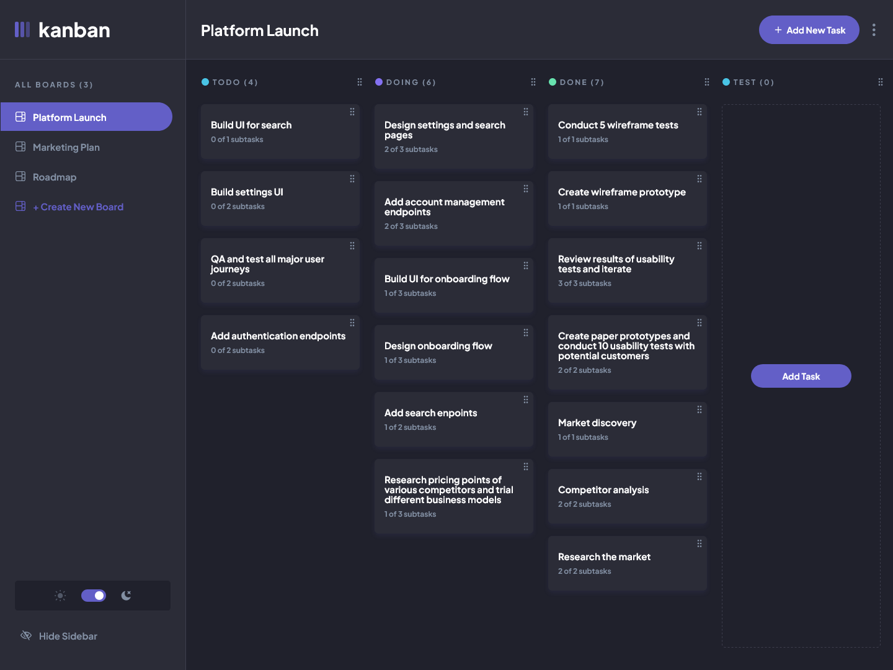
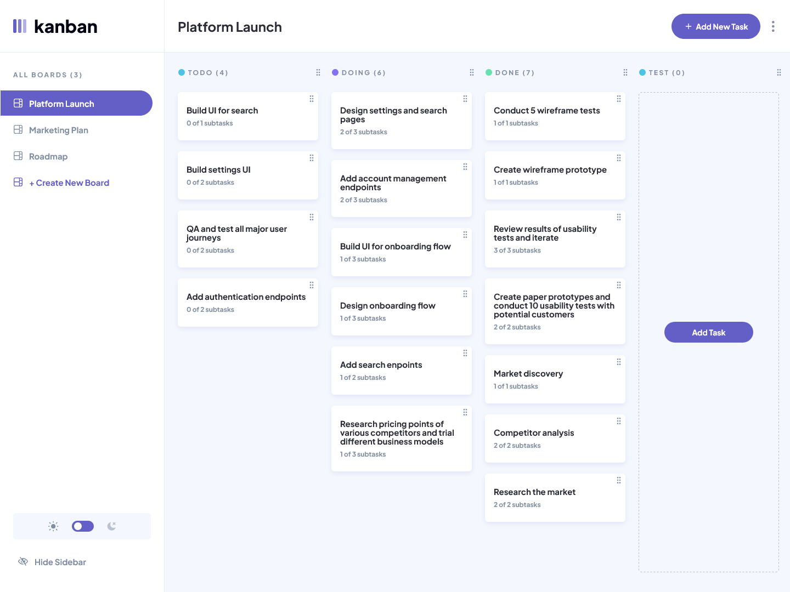

# Kanban Task Management App

The application opens directly into the dashboard experience and centers on board management, task organization, and drag-and-drop interactions.

<table>
	<tr>
		<td></td>
		<td></td>
	</tr>
</table>

## Overview

A responsive Kanban dashboard with a collapsible desktop sidebar, a compact mobile board switcher, theme support, and a fully interactive board canvas. Application state is managed on the client and persisted to `localStorage`.

### Capabilities

- Create, edit, and delete boards, columns, tasks, and subtasks.
- Move tasks between columns and mark subtasks as complete.
- Reorder columns and drag tasks within or across columns.
- Switch boards from the desktop sidebar or the mobile board picker.
- Toggle between light and dark themes.
- Persist dashboard state between browser sessions.

### Solution

- Live URL: [Kanban](https://kanban.ayob.dev)
- Solution URL: [Kanban Challenge](https://www.frontendmentor.io/challenges/kanban-task-management-web-app-wgQLt-HlbB)

### Technology

- Next.js 16 App Router
- React 19
- TypeScript
- Tailwind CSS v4
- shadcn/ui and Radix UI
- dnd-kit for drag and drop
- next-themes for theme management
- react-hook-form for form handling
- Biome for formatting and linting

## Getting Started

1. Install dependencies with `pnpm install`.
2. Start the development server with `pnpm dev`.
3. Open the app in your browser and explore the dashboard.

### Available Scripts

- `pnpm dev` starts the development server.
- `pnpm build` creates a production build.
- `pnpm start` runs the production server.
- `pnpm lint` runs Biome checks.
- `pnpm format` formats the codebase with Biome.

### Project Notes

- The dashboard is composed from shared shell, header, sidebar, and main board components.
- Initial board data is stored in `src/data.json` and hydrated into the client-side state store.
- Design tokens and theme variables are defined in `src/app/globals.css` and follow the repository design system.

## Author

Ahmad Yousif

Links: [Github](https://github.com/ahmadyousif89) & [Frontendmentor](https://frontendmentor.io/profile/ahmadyousif89)
